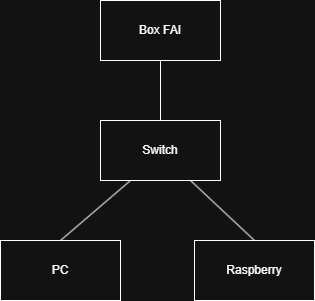

# Blue Lab Security

#### Mini-lab Blue Team pour entraînement SOC maison (Home SOC).

### Objectifs :
1. Détecter du trafic suspect sur un petit LAN isolé
2. Automatiser des scans (Nmap) et alertes (Suricata)
3. Centraliser les logs pour visualisation type SOC

### Matériel
- Raspberry Pi 5 (8 Go) – Docker + Suricata
- Netgear GS305EP – VLANs + port-mirroring
- PC portable – IDE + tests Nmap

### État du projet
- [X] Raspberry Pi accessible en SSH
- [X] Topologie réseau initiale documentée
- [ ] Configuration Suricata
- [ ] Dashboard OpenSearch
- [ ] Scripts d’automatisation Nmap

### Topology

### Documentation
- [docs/ip_plan.md](docs/ip_plan.md) – Plan IP actuel
- [configs/](configs) – Sauvegardes de config Pi & switch

---

MIT Licence – usage limité à mon réseau lab.